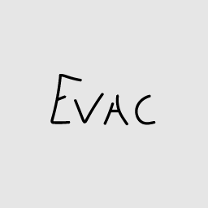

## Anton Galuts

---



---

## My Contact Info

---

* E-mail: *lil_evac@mail.ru*
* VK: [*Anton Galuts*](https://vk.com/lil_evac)
* Discord: *evac#4700*
* GitHub: [*EvacToha*](https://github.com/EvacToha)

## About Me

---

I am 18 years old. I study at BGUIR. During my studies, I work with many languages and technologies. Front-end development seemed interesting to me. I want to make some progress in this direction.

My strengths:

* Quick learner.
* Involvement in the development process.
* The pursuit of excellence.
* Teamwork.

## Skills and Proficiency

---

* HTML/CSS
* JavaScript
* React
* Git/GitHub
* Rider/Webstorm

## Code Examples

---

```
export const turnImage = (arr) => {
    const size = arr.length;
    for(let i = 0; i < Math.ceil(size / 2); ++i) {
        let inc = 0;
        let endJ = size - i - 1;
        for(let j = i; j < endJ; ++j) {
            arr[i][j] = [arr[i + inc][endJ], arr[i + inc][endJ] = arr[i][j]][0];
            arr[i][j] = [arr[endJ][endJ - inc], arr[endJ][endJ - inc] = arr[i][j]][0];
            arr[i][j] = [arr[endJ - inc][i], arr[endJ - inc][i] = arr[i][j]][0];
            inc++;
        }
    }
    return arr;
}
```

## Education

---

* Belarusian State University of Informatics and Radio Electronics
    + Computer Systems and Networks
* Udemy
    + Full course on React

## Languages

---

* Russian - native speaker.
* Belarusian - native speaker.
* English - A1.
